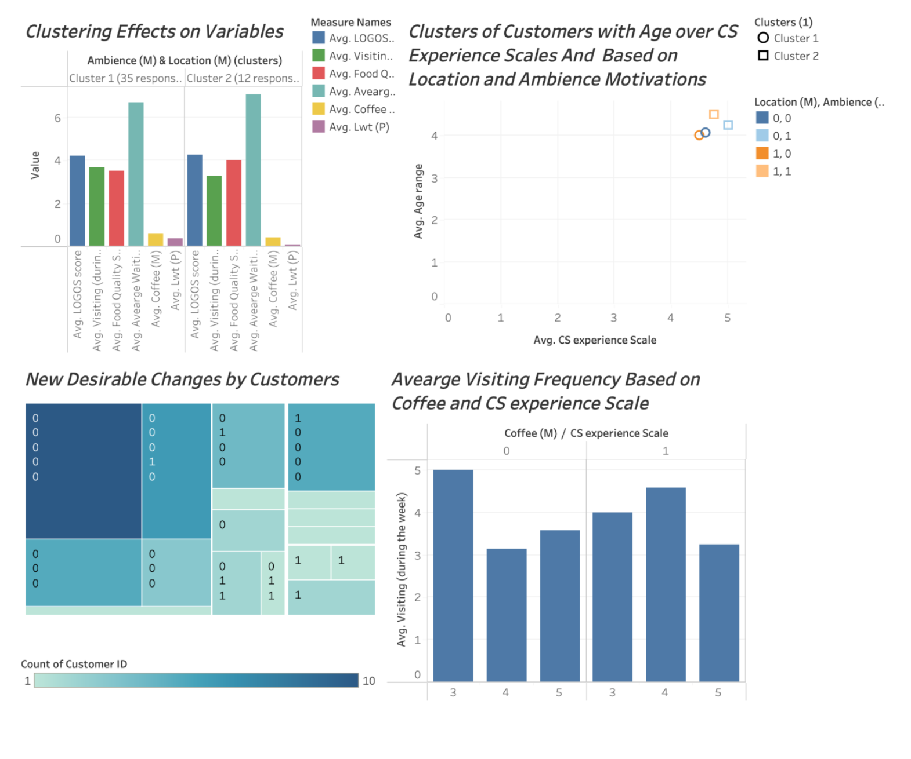

# First Project for a Small Local Cafe

## Table of Contents

- LOGOS Café Market Research Analysis - page 3
- Literature Review - page 3
- LOGOS Café Analysis - page 5
- Method - page 9
- Analysis - page 9
  - Correlation Matrix - page 10
  - Linear Regression Analysis - page 11
  - Clustering Analysis- page 12
  - Final Analysis - page 14
- Conclusion and Recommendations - page 16
- References - page 16

## Overview of the Report

This project was conducted in my local cafe (LOGOS) where I currently work. The purpose of this market research analysis project was to assist LOGOS café to gain a competitive advantage within the local area by identifying factors responsible for customers' decision to visit LOGOS café more frequently and developing focus groups of customers to better understand the need of the customers.

To achive this objective, tools such as SurveyMonkey, Excel and Tableau were utilised to gain insights into customers behavioural and preferencial choises. Excel was used due to a small number of records, while Tableau was use to visualise the findings.
