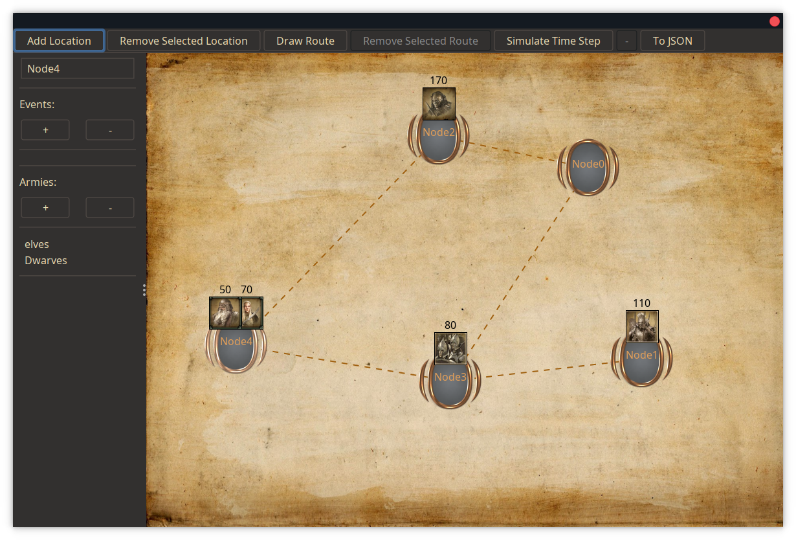

# RTS

In the epic conclusion of the OOP cinematic universe, you will be creating a Lord of the Rings-themed battle simulator. The idea is to provide the user with an editor where they can create a map consisting of locations and routes between those locations. The user can then add armies and simulate some battles!

> The above image is just an example.

The map is resembled by a simple undirected graph. In this graph, the nodes represent important locations, while edges represent routes between those locations. In the world, there are several armies. These armies move from location to location. On any location or route, the armies can encounter events. If enemy armies encounter each other, they will battle it out, until only one team survives. It is your job to create an editor that allows the user to configure these locations, routes, armies and events. Once the user is happy with their configuration, they will be able to simulate the scenario they created.

This final assignment demostrates several skills such as Swing, MVC, Java IO, and the ability to complete a reasonably complicated project.
